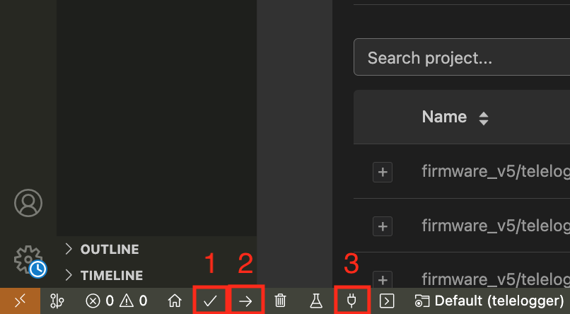

&nbsp;
&nbsp;
<p align="center">
  
</p> 

&nbsp;

# Incremental Anomaly Detection in Multivariate Time Series for IoT Devices with a TinyML Approac

### ✍🏾Authors: [Morsinaldo Medeiros](https://github.com/Morsinaldo), [Marianne Diniz](https://github.com/MarianneDiniz), [Ivanovitch Silva](https://github.com/ivanovitchm), [Dennis Brandão]()

## 1. Abstract/Overview

The Internet of Things (IoT) has led to the widespread generation of multivariate time series that require real-time anomaly detection to ensure the reliability of monitoring and control processes. However, traditional methods based on offline training and batch processing are unsuitable for embedded devices, which operate under memory, computational, and energy constraints. To address these challenges, this work proposes two lightweight incremental algorithms derived from the TEDARLS framework. Both algorithms operate without prior training, updating their internal statistics in real-time, and are optimized for TinyML platforms. A case study was conducted in two stages, the models were first evaluated offline in a Python environment to analyze detection accuracy, correction behavior, and computational efficiency; subsequently, the algorithms were embedded on a Freematics One+ device connected to vehicles via the On-Board Diagnostics II (OBD-II) interface. MSTEDARLS achieved approximately 99% precision and 100% recall with inference times around 500 microsseconds, maintaining the original data characteristics. MPTEDARLS, although more sensitive to multivariate patterns, induced greater distortions and required processing times exceeding 4,200 microsseconds. Overall, MSTEDARLS demonstrated better stability and is more suitable for real-time anomaly correction in resource-constrained IoT edge applications.


This repository contains the source code and experimental materials associated with the MSTEDARLS (Multivariate Sequential TEDA-RLS) and MPTEDARLS (Multivariate Parallel TEDA-RLS) algorithms, developed for online anomaly detection and correction in multivariate vehicular data streams.

Both algorithms are designed to operate in real time, making them suitable for edge computing scenarios involving vehicular telemetry, such as OBD-II data acquisition.

## Repository Structure 📂

- **`./Freematics/`** — Source code from the Freematics project used for the embedded experiments (ESP32, OBD-II communication, etc.).
- **`./src/`** — Source code developed for MSTEDARLS and MPTEDARLS.
  - **`./src/cpp/`** — C++ implementations for embedded systems.
- **`./data/`** — Datasets used for experiments, including preprocessed vehicular data.
- **`./figures/`** — Figures generated for analysis and publication.
- **`.git/`** — Version control metadata (Git).

## Datasets 📈

All experimental datasets are provided in `.csv` format within the `data/` folder.  
Each file contains the following variables:

| Variable | Description |
|:--------:|:-----------|
| `speed` | Vehicle speed (km/h) |
| `rpm` | Engine revolutions per minute (rpm) |
| `tp` | Throttle position (%) |
| `load` | Engine load (%) |
| `timing` | Ignition timing advance (°) |

The datasets are organized as follows:
- **Original data** — Vehicular signals without injected anomalies.
- **Corrected data** — Data after processing with MSTEDARLS or MPTEDARLS.

## Getting Started 🚀

### 1️⃣ Cloning the Repository
```bash
git clone https://github.com/conect2ai/ETFA2025-MSTEDARLS-MPTEDARLS.git
cd ETFA2025-MSTEDARLS-MPTEDARLS
```

### 2️⃣ Installing Dependencies
It is recommended to use Python 3.11+ with a virtual environment (venv or conda):

```bash
pip install -r requirements.txt
```

### 3️⃣ Running the Notebooks
Open the `.ipynb` files using Jupyter Notebook or JupyterLab and execute the cells according to the instructions provided in each section.

## Executing on Freematics One+

### 4️⃣ Opening the Project
Open the project folder `./Freematics/firmware_v5/telelogger` on PlatformIO, as illustrated in the figure below.

<p align="center">
  
</p>

### 5️⃣ Connecting the Device
Connect the Freematics One+ to your computer and turn it on using the Freematics Emulator or inside the vehicle.

### 6️⃣ Compiling, Uploading, and Monitoring
Compile, upload, and monitor the serial (steps 1, 2, and 3, respectively, in the figure below).

<p align="center">
  
</p>

---

## :page_facing_up: Licença

This project is licensed under the MIT License - see the [LICENSE](LICENSE) file for details.

--- 

# Sobre nós

The [**Conect2AI**](http://conect2ai.dca.ufrn.br) research group is composed of undergraduate and graduate students from the Federal University of Rio Grande do Norte (UFRN) and aims to apply Artificial Intelligence (AI) and Machine Learning in emerging areas. Our expertise includes Embedded Intelligence and IoT, optimizing resource management and energy efficiency, contributing to sustainable cities. In the energy transition and mobility, we apply AI to optimize energy use in connected vehicles and promote more sustainable mobility.
